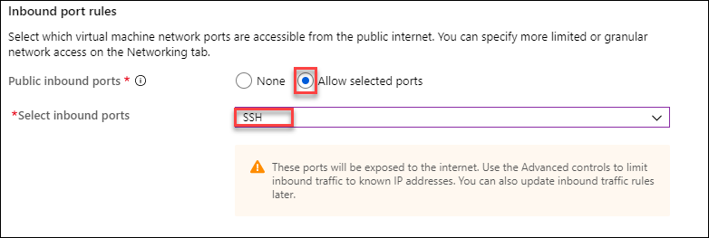

# Module 0: Introduction to Azure Portal

   * [Exercise 01: Sign Up for Pre-configured Environment](#exercise-01-sign-up-for-pre-configured-environment)
 
 ### Lab Overview
This lab will take you through Azure login and portal experience and the pre-requisite environment.

### Option 1: Using Preconfigured Environment

### Time Estimate

10 minutes

### Exercise 1: Sign Up for pre configured environment

In this exercise, you will create a source environment.
1.	**Navigate** to bitly link which was provided by instructor and register by providing all required information and **clicking** on **SUBMIT button**.<br/>
<br/>

2. Once registration is accepted, you will be automatically redirected to the lab activation page. Now, it is advised to save a copy of the URL on the browser, which has the activation id. **Click** on the **Launch Lab** button.<br/>
<br/>

3. You will see the environment details soon below.<br/>
<br/>
Please ensure to take the values assigned to your deployment.

### Exercise 2: Log into your Azure Portal and Verify access to the Subscription

In this exercise, you will log into the **Azure Portal** using your Azure credentials and you will verify the type of role you are assigned in this Subscription.
1.  **Navigate** to https://portal.azure.com and login (from the previous step).
2.  **Enter** the **Username** which was displayed in the previous window and **click** on **Next**.<br/>
<br/>
3.	In the Stay signed in? pop-up window, click **No**. **Enter** the **Password** and click on **Sign in**.<br/>
<br/>

### Exercise 3: Create a Linux virtual machine in the Azure portal

**Use Azure Cloud Shell** <br/>
Azure hosts Azure Cloud Shell, an interactive shell environment that you can use through your browser. Cloud Shell lets you use either bash or PowerShell to work with Azure services. You can use the Cloud Shell pre-installed commands to run the code in this article without having to install anything on your local environment.<br/>

1. Select the Cloud Shell button on the top-right menu bar in the Azure portal.<br/>
<br/><br/>
2. Select Bash.<br/>
<br/>
3. Select your suscription and click on show advance setting aand fill required information to create storage account and then select      create storage. <br/>
<br/>
<br/>

**Create SSH key pair**

You need an **SSH key pair** to complete this quickstart. If you already have an SSH key pair, you can skip this step.

1. Open a **bash shell** and use ssh-keygen to create an SSH key pair. If you don't have a bash shell on your local computer, you can      use the Azure Cloud Shell.<br/>

2. In the menu at the top of the page, select the **>_** icon to open Cloud Shell.<br/>

3. Make sure the CloudShell says Bash in the upper left. If it says PowerShell, use the drop-down to select Bash and select Confirm to      change to the **Bash shell**.<br/>

4. Type **ssh-keygen -t rsa -b 2048** to create the ssh key.<br/>

5. You will be prompted to enter a file in which to save the key pair. Just press **Enter** to save in the default location, listed in      brackets.<br/>

6. You will be asked to enter a **passphrase**. You can type a passphrase for your SSH key or press Enter to continue without a            passphrase.<br/>

7. The ssh-keygen command generates public and private keys with the default name of id_rsa in the **~/.ssh directory**. The command        returns the full path to the public key. Use the path to the public key to display its contents with cat by typing 
   **cat ~/.ssh/id_rsa.pub**.<br/>    
   
8. Copy the output of this command and save it somewhere to use later in this article. This is your public key and you will need it when    configuring your administrator account to log in to your VM.<br/>

**Create virtual machine**

1. Choose **Create a resource** in the upper left corner of the Azure portal and select **Ubuntu Server 18.04 LTS**.<br/>
<br/>
2. In the Basics tab, under Project details, make sure the correct **Subscription** is selected and then choose your **Resource group**.<br/>
<br/>
3. Under Instance details, type **Name of VM** for the Virtual machine name and choose East US for your Region. Leave the other            defaults.<br/>
<br/>
4. Under Administrator account, select SSH public key, type your **User Name**, then paste in your **Public Key**. Remove any leading or    trailing white space in your public key.<br/>
<br/>
5. Under **Inbound port** rules > Public inbound ports, choose Allow selected ports and then select **SSH (22)** from the drop-down.<br/>
<br/>
6. Leave the remaining defaults and then select the **Review + create** button at the bottom of the page.<br/>

7. On the Create a virtual machine page, you can see the details about the VM you are about to create. When you are ready, select        **Create**.<br/>

8. Connect to virtual machine<br/>
  
  -Run this command in Azure CLI<br/>
  ```
    ssh azureuser@10.111.12.123
  ```

### Exercise 3: Create a virtual machine scale set and deploy a highly available app on Linux with the Azure CLI

A **Virtual Machine Scale Set** allows you to deploy and manage a set of identical, auto-scaling virtual machines. You can scale the number of VMs in the scale set manually, or define rules to autoscale based on resource usage such as CPU, memory demand, or network traffic. In this exercise, you deploy a virtual machine scale set in Azure. You learn how to:<br/>

- Use **cloud-init** to create an app to scale<br/>
- Create a **Virtual Machine Scale Set**<br/>
- Increase or decrease the number of instances in a scale set<br/>


**Create an app to scale** <br/>

For production use, you may wish to Create a custom VM image that includes your application installed and configured.So we create custom script for nagix web server with index.js file.Which we deploy<br/>

**Create a scale set** <br/>

1. create a virtual machine scale set with az vmss create<br/>. 

```
az vmss create --resource-group YourResourceGroupName --name NameofYourScaleset --image UbuntuLTS --upgrade-policy-mode automatic --custom-data cloud-init.txt --admin-username azureuser --generate-ssh-keys 
```
  
  2. To allow traffic to reach the web app, create a rule with az network lb rule create.<br/>
 ```
az network lb rule create --resource-group YourResourceGroupName --name myLoadBalancerRuleWeb --lb-name NameofScaleSetLB --backend-pool-name NameofScaleSetLBBEPool --backend-port 80 --frontend-ip-name NameofloadBalancerFrontEnd --frontend-port 80 --protocol tcp
  ```
  
  3. Enter the public IP address in to a web browser. The app is displayed, including the hostname of the VM that the load balancer          distributed traffic to <br/>
  
  4. To view a list of VMs running in your scale set, use az vmss list-instances as follows:
  ```
az vmss list-instances --resource-group myResourceGroupScaleSet --name myScaleSet --output table 
  ```
  
  5. You can then manually increase or decrease the number of virtual machines in the scale set with az vmss scale. The following             example sets the number of VMs in your scale set to 3: <br/>
```
az vmss scale --resource-group myResourceGroupScaleSet --name myScaleSet --new-capacity 3
  ```
  


